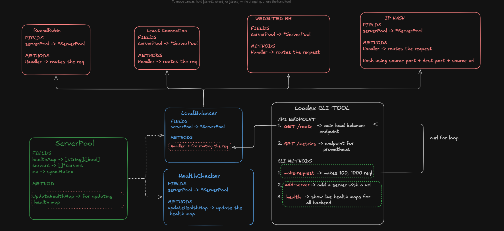
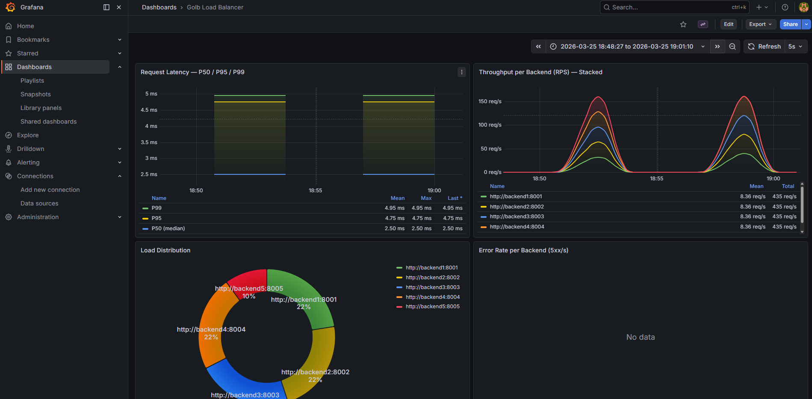

# Loadex

**A fast, observable, multi-algorithm load balancer written in Go.**

[](https://go.dev)
[](https://docker.com)
[](https://k6.io)
[](LICENSE)


---

`Loadex` is a high performance HTTP Load balancer written in Go. Features Round Robin, Weighted Round Robin, Least Connection, and IP Hash. Active connection tracking and supports production grade monitoring using Prometheus and Grafana 

- **Routing Algorithms** : Round Robin, Weighted Round Robin, Least Connection, IP Hash for efficient load distribution
- **Active health checking** : Periodic health monitoring of backend servers with configurable interval
- **Automatic Failover** : Automatically routes traffic away from unhealthy servers
- **Reverse Proxy** : Built on Go's httputil.ReverseProxy for efficient request forwarding
- **Thread-Safe** : Uses mutexes and atomic operations for concurrent safety
- **Monitoring and Observability Setup** : Pre-configured grafan dashboards featuring request count, P95/P99 latency histogram, per-backend throughput
---

## Why Loadex 
Built for Learning & Practicing Production Patterns

Loadex was created to deeply understand load balancers and practice creating cli tools with production grade monitoring and testing. Unlike simple tutorials, Loadex includes production-ready features:

- **Real Fault Tolerance** : Survives the server crashes with automatic redirection and retry mechanism
- **Thread Safe** : Concurrent safe operations with mutexes
- **Full Observability** : Prometheus metrics + Grafana dashboards
- **Multiple Interfaces** : CLI and REST API.
- **Production Features** : Health checks, Monitoring, Multiple Algorithms

**Use Cases**:
- Small projects
- Learning backend systems concepts
- Interview project showcase

**Not Suitable For**:
- Large-scale production grade systems (use nginx or HAProxy)

## Features
**Interfaces**
- **CLI Tool** (`Loadex`): Command-line administration with making requests and monitoring backend servers
- **REST API** : Full HTTP/JSON API for programmatic management and health checking

Operations
Health Checks: Active HTTP health checks to backend servers
Metrics: Prometheus-compatible /metrics endpoint
Observability: Docker Compose setup with Prometheus + Grafana
Tech Stack: Go • Docker • Prometheus • Grafana

Test Coverage:
Unit tests (all algorithm covered)
E2E integration tests (load distribution, )
Chaos tests (network partitions)
Load tests (concurrent operations)
Stress tests (24-hour stability)

## Architecture
The Load Balancer consists of four main components 
1. ServerPool: Manages a collection of backends and health map for tracking which backends are healthy and which are not
2. Backend: Represents a backend server with health status and connection tracking
3. Health Checker: Periodically checks backend health via HTTP health endpoints and updates the health map in the server pool
4. Load Balancer : Implements different load balancing algorithm along with some unit tests

---

## Algorithms

| Flag | Algorithm | Description |
|------|-----------|-------------|
| `roundrobin` / `rr` | Round Robin | Distributes requests evenly in sequence |
| `weightedroundrobin` / `wrr` | Weighted Round Robin | Alternates weights [2,1] across backends |
| `leastconnection` / `lc` | Least Connection | Routes to the backend with fewest active connections |
| `iphash` / `ip` | IP Hash | Consistent routing — same client always hits same backend |

---

## How It Works

* **Request Routing**: When a request arrives, the load balancer selects the next healthy backend using the selected algorithm.
* **Connection Tracking**: Active connections are incremented when a request is forwarded and decremented when the response is received.
* **Health Monitoring**: A background goroutine periodically checks each backend's `/health` endpoint.
* **Failover**: Unhealthy backends are automatically excluded from the rotation until they recover.

## Logging

The load balancer logs:
* Backend addition events
* Health check start/status
* Backend health status (up/down)
* Proxy errors
* Server startup information

## Error Handling

* **No Healthy Backends**: Returns `HTTP 502 Bad Gateway` with an error message.
* **Invalid Backend URLs**: Fails to start with a fatal error.
* **Proxy Errors**: Logs errors and returns `502` to the client.

## Thread Safety

The implementation uses:
* `sync.RWMutex` for read/write locks on shared data structures.
* `sync/atomic` for lock-free operations on connection counters and indices.
* Goroutines for concurrent health checks.

---

## Installation

### Option A: With Docker (recommended) Full Stack (5 Backend Servers + Load Balancer + Prometheus + Grafana)

Start a 5-node backends with load balancer with Prometheus and Grafana monitoring:
```bash
docker compose up -d
```

| Service | URL |
|---------|-----|
| Load Balancer | http://localhost:8080 |
| Prometheus | http://localhost:9090 |
| Grafana | http://localhost:3000 (admin / admin) |

Then **open Grafana → Dashboards → Golb Load Balancer** to see the live dashboard.

### Install the CLI (Loadex)

To interact with your cluster locally, install the CLI:

```bash
make install
```
This installs `loadex` to `$GOPATH/bin`. Make sure it's in your PATH:

```bash
export PATH="$(go env GOPATH)/bin:$PATH"
```

Verify installation:
```bash
loadex --help
```

### Step 4: Use the CLI

Now you can interact with your load balancer:

```bash
# Check the health of all registered backend servers
loadex health --url http://localhost:8080

# Simulate traffic by sending requests to the load balancer
loadex make-request --count 100 --url http://localhost:8080

# Dynamically add a new backend server
loadex add-server --target http://localhost:8006 --admin-url http://localhost:8080

# Manually mark a backend server as dead
loadex kill-server --target http://localhost:8001 --admin-url http://localhost:8080
```

### View Metrics
Check out the monitoring stack:

* **Prometheus**: http://localhost:9090
* **Grafana**: http://localhost:3000 (login: admin/admin)

**Grafana Dashboard Preview**


### What You Have Now
A fully functional Load Balancer ecosystem with:

* A proxy routing traffic across backend nodes
* CLI tool (`loadex`) for operations and load testing
* Web dashboard (Grafana) for visual management
* Prometheus tracking requests, latencies, and backend health
* Automatic failover routing around unhealthy nodes

### Try It Out
Test the cluster's fault tolerance:

```bash
# Run a load benchmark to see traffic distribution
loadex make-request -c 20

# Kill one of the backend nodes
docker compose stop backend1

# Check the health map to see it marked as dead
loadex health

# Run the benchmark again and observe that no traffic is routed to the killed backend
loadex make-request -c 20
```

### Stop the Cluster
When you're done:

```bash
docker compose down
```

### Option B: Build locally

```bash
make build        # Builds all three binaries into ./bin/
```
Start the load balancer server and backend servers:
```bash
./bin/loadbalancer -port 8080 -backends http://localhost:8001,http://localhost:8002
```

### HTTP/REST API
The Load Balancer exposes administrative REST endpoints:

* **`GET /api/health`** - Retrieve a JSON map of all backend URLs and their health status.
* **`POST /api/kill?url={TARGET_URL}`** - Forcefully mark a backend server as dead.
* **`POST /api/add?url={TARGET_URL}`** - Add a new backend server to the server pool dynamically.
* **`GET /metrics`** - Prometheus metrics export endpoint.

### Building from Source

**Prerequisites**
* Go 1.25 or later
* Docker (optional, for Docker Compose setup)
* Make (optional, for convenience)

**Clone and Build**
```bash
# Clone repository
git clone https://github.com/distroaryan/golb.git
cd golb

# Build binaries
make build

# Or build manually
go build -o bin/loadbalancer ./cmd/loadbalancer
go build -o bin/loadex ./cmd/loadex
go build -o bin/backend ./cmd/backend

# Install to $GOPATH/bin
make install
```

**Make Targets**
```bash
make build          # Build binaries to ./bin/
make install        # Install to $GOPATH/bin
make clean          # Remove build artifacts
make test           # Run all tests
make test-e2e       # Run integration tests
make docker-build   # Build Docker image
make docker-up      # Start cluster
make docker-down    # Stop cluster
make help           # Show all targets
```

## Observability

### Prometheus Metrics

| Metric | Type | Labels |
|--------|------|--------|
| `golb_requests_total` | Counter | `method`, `status`, `backend` |
| `golb_request_duration_seconds` | Histogram | `method`, `status`, `backend` |

### Grafana Dashboard

Pre-provisioned at `observability/grafana-dashboard.json`. Panels:

- **P50 / P95 / P99 Latency** — smooth time-series with gradient fill
- **Throughput per Backend** — stacked RPS view
- **Load Distribution** — donut chart showing % traffic per backend
- **Error Rate** — 5xx rate per backend

---

## Project Structure

```
golb/
├── cmd/
│   ├── backend/        # Dummy backend HTTP server
│   ├── loadbalancer/   # Main LB server (proxy + admin API)
│   └── loadex/         # CLI tool (Cobra)
├── load_balancers/     # RR, WRR, LC, IPHash algorithms + tests
├── health_checker/     # Active HTTP health check loop
├── server_pool/        # Thread-safe backend registry
├── observability/      # Prometheus metrics, Grafana provisioning
├── k6/                 # k6 load test script
├── scripts/            # Demo scripts (bash + PowerShell)
├── Dockerfile
├── docker-compose.yml
└── Makefile
    ReadMe <--- you're here
```

---

## Running a Specific Algorithm

```bash
docker compose run --rm loadex /app/loadbalancer \
  -port 8080 \
  -algo leastconnection \
  -backends http://backend1:8001,http://backend2:8002
```

---

## License

MIT — see [LICENSE](LICENSE)
